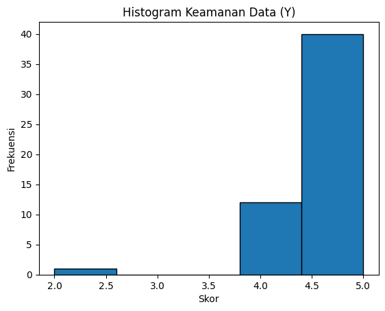
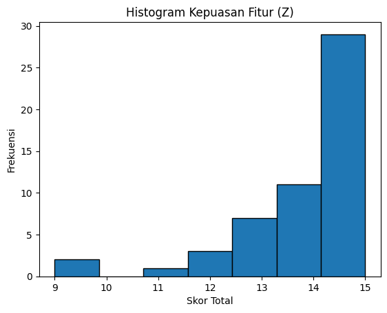

# Analisis Kepuasan Pengguna Aplikasi Pajak Kendaraan

Proyek ini merupakan bagian dari tugas magang/studi pada Vinix yang berfokus pada analisis kepuasan pengguna terhadap aplikasi pajak kendaraan digital. Analisis dilakukan berdasarkan data survei sebanyak 53 responden dengan tiga variabel utama:

- X — Kemudahan Penggunaan  
- Y — Kepercayaan terhadap Sistem  
- Z — Kepuasan Fitur dan Pengalaman Pengguna  

---

## 1. Tujuan Proyek
- Mengukur tingkat kemudahan penggunaan aplikasi.  
- Menilai tingkat kepercayaan pengguna terhadap keamanan data.  
- Mengevaluasi tingkat kepuasan terhadap fitur aplikasi.  
- Memberikan rekomendasi peningkatan berdasarkan hasil analisis.

---

## 2. Dataset
Dataset berasal dari kuesioner pengguna dan diolah menggunakan SPSS serta Excel.  
Data yang dimasukkan ke dalam repositori telah disesuaikan untuk memastikan keamanan dan privasi.

File yang digunakan:
- Statistik deskriptif  
- Tabel frekuensi  
- Histogram untuk masing-masing variabel

---

## 3. Hasil Analisis

### 3.1 Kemudahan Penggunaan (X)
- Mean: 4.74  
- Standar Deviasi: 0.524  
Mayoritas pengguna menilai aplikasi mudah dipahami dan digunakan.

### 3.2 Keamanan Data (Y)
- Mean: 4.72  
- Standar Deviasi: 0.568  
Tingkat kepercayaan pengguna terhadap keamanan data cukup tinggi, meskipun terdapat sebagian kecil pengguna yang masih memiliki kekhawatiran.

### 3.3 Kepuasan Fitur (Z)
- Mean: 14.06  
- Rentang nilai: 9–15  
Secara umum pengguna merasa puas, namun terdapat variasi penilaian yang menunjukkan adanya beberapa fitur yang perlu ditingkatkan.

---

## 4. Rekomendasi
- Meningkatkan transparansi terkait keamanan dan pengelolaan data.  
- Mengevaluasi fitur yang belum sepenuhnya memenuhi kebutuhan pengguna.  
- Mempertahankan pengalaman navigasi yang mudah dan intuitif.

---

## 5. Visualisasi

### Histogram Variabel X (Kemudahan Penggunaan)

### Histogram Variabel Y (Keamanan Data)

### Histogram Variabel Z (Kepuasan Fitur)

---

## 6. Teknologi dan Tools
- SPSS  
- Microsoft Excel  
- Python (opsional untuk analisis tambahan)

---

## 7. Struktur Repositori
data/
analysis/
visualization/
reports/

---

## 8. Kontributor
Proyek ini disusun oleh **Syarifa Anastasya Putri** sebagai bagian dari pengembangan portofolio Data Analyst.
